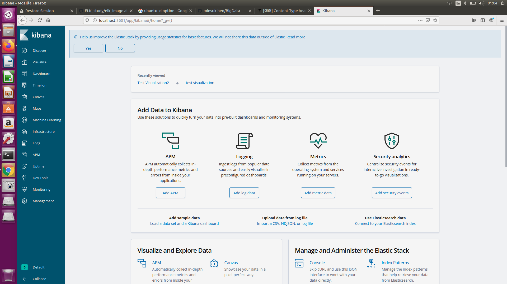
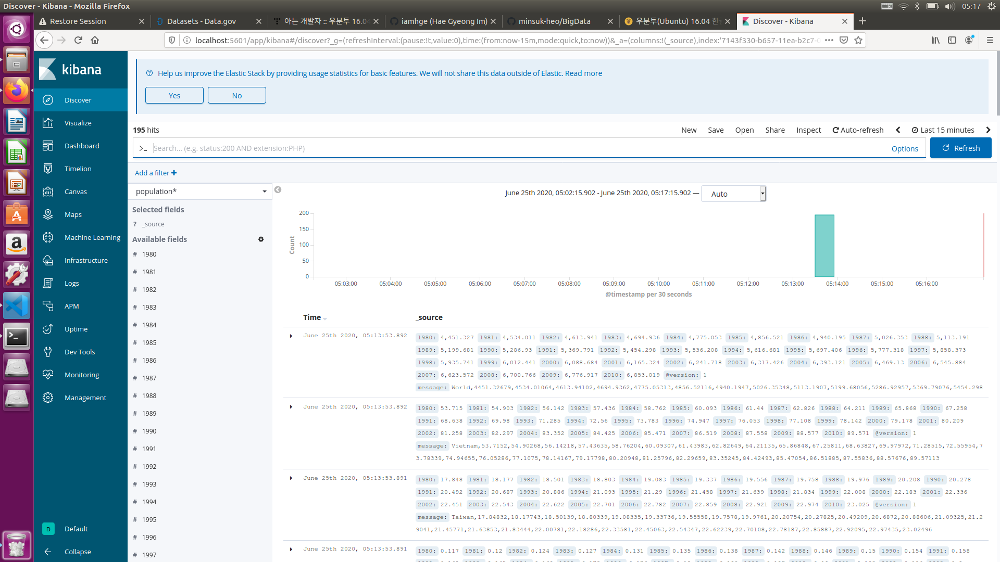
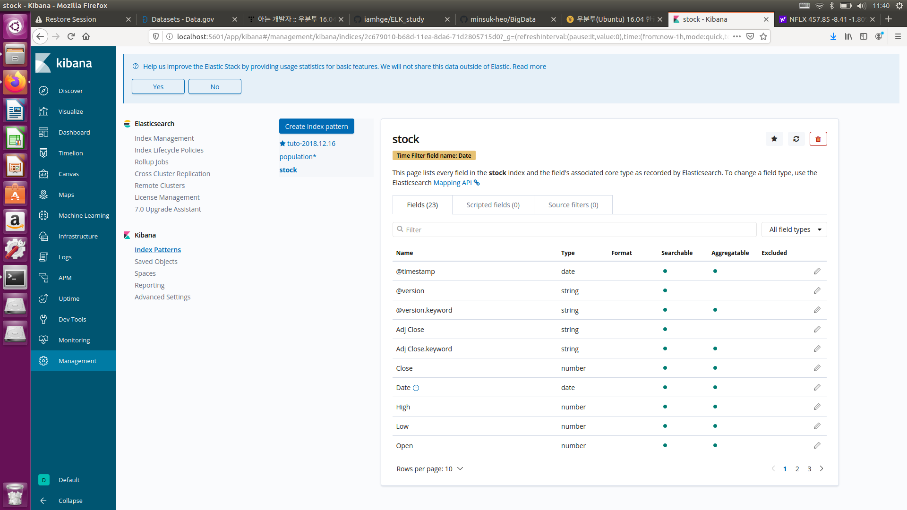

# ELK 활용 - 실데이터 분석 실습
본 실습은 inflearn의 허민석님의 강의와 github ch06의 자료를 토대로 진행하며 작성하였음.  
## 1. 인구분석

    $ <elasticsearch 패키지 위치>/bin/elasticsearch -d
    $ sudo systemctl start elasticsearch.service
    $ sudo systemctl start kibana.service
    $ sudo <logstash 패키지 위치>/bin/logstash -f ~/<logstash.conf 파일 위치>/logstash.conf

* ES, kibana를 먼저 실행시킨다.
* logstash를 실행시킨다.  

  
<logstash.conf>  

  
<Kibana 시작 화면>  

  
<Kibana에서 population index create>  

  
<next step 후 time stamp 설정>  

  
<population 확인>  

  
<discover 확인>  

  
<toggle을 사용하여 원하는 정보만 pick>  

  
<population dash board>

## 2. 주식 분석

1. 검색창에 yahoo stock을 검색한다.  
2. yahoo finance에 들어가 주식 분석을 원하는 기업명을 서치한다. ex) NFLX, FB, ...
3. time period를 설정하고 apply 후 download 받는다. 

    $ sudo <logstash 패키지 위치>/bin/logstash -f ~/<logstash.conf 파일 위치>/logstash_stock.conf

  
<logstash_stock.conf>  

  
<위의 logstash 실행 후 로그 출력 정보>    

  
<time stamp 설정>  

    
<stock 확인>  

  
<discover 확인>  

  
<stock dash board>  
