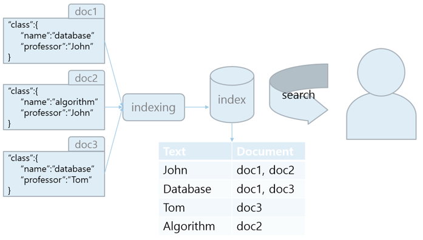

# Elastic Search

## 1. Elastic Search와 관계형 DB
### 1.1. ES의 data flow
ex) document 1, 2, 3에 따라 name과 professor가 채워져있다.  
1. document들을 Text에 따라 매칭시켜, indexing한다.  
2. 저장한 index를 사용자가 search한다.
  
<elasticsearch의 data flow>  

### 1.2. 저장방식의 차이
|Text|Document|
|---|---|
|John|doc1, doc2|
|Database|doc1, doc3|
|Tom|doc3|
|Algorithm|doc2|

<ES의 저장방식에 따른 index>  

|Documnet|context|
|---|---|
|doc1|"class":{  "name":"database"  "professor":"John"  }|
|doc2|"class":{  "name":"algorithm"  "professor":"John"  }|
|doc3|"class":{  "name":"database"  "professor":"Tom"  }|

<관계형 데이터 베이스의 저장방식에 따른 database>

#### ES
* 키워드를 저장하여, 키워드에 따른 document의 검색이 가능하다.  
* 방식이 해시 테이블 자료구조와 비슷하여, Big-O notation 관점에서 보면 order 1의 복잡도를 가진다.

#### RDB(관계형 데이터 베이스)
* document 각각을 모두 순회하며, 원하는 키워드를 검색한다.  
* search과정에서 document 1~n까지 모두 순회해야 하므로 order n 의 복잡도를 가지게 된다.  

so, 위와 같은 검색에서는 ES의 search가 매우 빠르게 된다.  
but, 데이터가 방대해짐에 따라 키워드가 많아지면 ES의 search 속도가 느려지게 되며, 관계형 DB를 사용함이 나을 수 있다.  

|Elastic Search|Relational DB|
|---|---|
|Index|Database|
|Type|Table|
|Document|Row|
|Field|Column|
|Mapping|Schema|
|Shard|Physical partition|
|Route|Logical partition|
|Parent/child, nested|Relational|
|Query dsl|sql|

<용어 차이>  

|Elastic Search|Relational DB|
|---|---|
|GET|Select|
|PUT|Update|
|POST|Insert|
|DELETE|Delete|

<데이터 접근 명령어 차이>  

## 2. Elastic Search 데이터 입력 조회 삭제
### 2.1. 데이터 입력 조회 삭제

ES는 REST API 사용
#### REST API 
HTTP 기반으로 필요한 자원에 접근하는 방식을 정해놓은 아키텍쳐  
자원별로 고유 URL로 접근이 가능  
http 메서드 GET, PUT, POST, DELETE를 이용해서 자원을 처리  
-> 이러한 특성을 가진 시스템을 RESTful한 시스템이라 말한다.  

RESTful한 시스템 ex)

    PUT https://user.com/iamhge -d {"name":"IHG", "age":22, "gender":"f"}
    GET https://user.com/iamhge
    DELETE https://user.com/iamhge

|Elastic Search|Relational DB|CRUD|
|---|---|---|
|GET|Select|Read|
|PUT|Update|Update|
|POST|Insert|Create|
|DELETE|Delete|Delete|

<ES, RDB, CRUD 비교>

elastic search 내에 index 유무 확인

    $ curl -XGET http://localhost:9200/<조회할 index명>?pretty
    $ curl -XGET http://localhost:9200/?pretty

GET : data 읽음
curl : ubuntu에서 REST API 보내기 위해 curl 커멘드 사용
-X : Prefix
?pretty : 결과값을 깔끔하게 확인하기 위한 명령 (json type)
status 404가 뜨면 해당 index가 없다는 의미

index 생성

    $ curl -XPUT http://localhost:9200/<만들 index명>?pretty
    $ curl -XPUT http://localhost:9200/classes?pretty
    
true가 뜨면 index 생성됐다는 의미

index 삭제

    $ curl -XDELETE http://localhost:9200/<삭제할 index명>?pretty
    $ curl -XDELETE http://localhost:9200/classes?pretty
    
true가 뜨면 index 삭제됐다는 의미

document 생성
index가 없어도 생성이 가능하다.
index명과 type명을 명시해주면 document 생성 가능

    $ curl -XPOST http://localhost:9200/<index명>/<type명>/{id}/ -d '{ : }'
    $ curl -XPOST http://localhost:9200/classes/class/1/ -d '{"title":"Algorithm", "professor":"John"}'
    
-d option

파일에 저장된 document 생성

    $ curl -XPOST http://localhost:9200/<index명>/<type명>/{id}/ -d @<파일명>
    $ curl -XPOST http://localhost:9200/classes/class/1/ -d @oneclass.json

------------

엘라스틱 서치 데이터 업데이트

document update  

    $ curl -XPOST http://localhost:9200/<index명>/<type명>/<id>/\_update -d '{"doc":"<update할 document명>":<update할 data>}}'
    $ curl -XPOST http://localhost:9200/classes/class/1/\_update -d '{"doc":{"unit":1}}' // 1학점임을 추가함

document 수정

    $ curl -XPOST http://localhost:9200/<index명>/<type명>/<id>/\_update -d '{"doc":"<수정할 document명>":<수정할 data>}}'
    $ curl -XPOST http://localhost:9200/classes/class/1/\_update -d '{"doc":{"unit":1}}' // 2학점이라 수정

script를 사용해 값을 변경

    $ curl -XPOST http://localhost:9200/classes/class/1/\_update -d '{"script":"ctx.\_source.unit += 5"}' // 2학점에서 5학점을 올려 7학점으로 수정

------------

엘라스틱 서치 벌크

여러개의 document를 한번에 ES에 삽입

    $ curl -XPOST http://localhost:9200/\_bulk?pretty --data-binary @<파일명>
    $ curl -XPOST http://localhost:9200/\_bulk?pretty --data-binary @classes.json

--data-binary : 파일으로부터 document 삽입

-------------
엘라스틱서치 매핑 (Mapping)(RDB의 schema)

mapping 없이 ES에 data를 넣을 수 있는가?
할 수 있다. 하지만 mapping없이 data를 넣는 것은 상당히 위험한 일.
ex) 숫자 정보를 입력하였지만, ES는 문자로 인식할 수 있다.

잘못지정된 type 때문에 kibana 등에서 잘못된 visualization 가능.

so, data를 관리할 때는 mapping을 추가해야한다.

mapping 채우기

    $ curl -XPUT 'http://localhost:9200/<index명>/<type명>/\_mapping' -d @<파일명>
    $ curl -XPUT 'http://localhost:9200/classes/class/\_mapping' -d @classesRating_mapping.json
   
mapping 완료 후 document를 삽입한다.

-------------
엘라스틱서치 데이터 조회 (Search)

    $ curl -XGET localhost:9200/<index명>/<type명>\_search?pretty
    $ curl -XGET localhost:9200/basketball/record\_search?pretty

URI 옵션

    $ curl -XGET localhost:9200/<index명>/<type명>\_search?q=<search할 data명>:<search할 data 값>&pretty
    $ curl -XGET 'localhost:9200/basketball/record\_search?q=points:30&pretty' // query는 points가 30인 것만 보여줘라

q : query

request body를 이용한 search

    $ curl -XGET 'localhost:9200/<index명>/<type명>\_search -d'
    {
        "query":{
            " ":{" ": }
        }
    }
    $ curl -XGET 'localhost:9200/basketball/record\_search -d'
    {
        "query":{
            "term":{"points":30}
        }
    }
    
request body에는 여러가지 옵션이 있다

-----------
엘라스틱서치 메트릭 어그리게이션 (Metric Aggregation)

aggregation
엘라스틱서치 안에 있는 document의 조합을 통해 어떠한 값을 도출할 때 쓰이는 방법

metric aggregation
산술할 때 쓰임 ex) 평균, 최댓값, 최솟값 구할 때

aggregation format

    "aggregations":{
        "<aggregation_name>":{
            "<aggregation_type>":{
                <aggregation_body>
            }
            [, "meta":{ [<meta_data_body>] } ]?
            [, "aggregations":{ [<sub_aggregation>]+ } ]?
        }
        [, "<aggregation_name_2>":{ ... } ]*
    }
    
ex) points의 평균값 구하기

    {
        "size":0, // 여러개의 정보가 도출되는 대신, aggregation 정보만 보기위해 size = 0으로
        "aggs":{  // aggregations
            "avg_score":{  // aggregation name
                "avg":{  // aggregation type
                    "field":"points"  // aggregation body
                }
            }
        }
    }
   
aggregation search 명령어

    $ curl -XGET localhost:9200/\_search?pretty --data-binary @<파일명>

aggs = aggregations  
avg : 평균값을 구할 것이다.  

원하는 결과값을 구하기 위해 <aggregation_type> 필드를 변경해본다.  
ex) max, min, sum, ..  

stats를 aggregation_name으로 사용하면 aggregation으로 구했던 모든 값들이 함께 출력된다.

--------------
엘라스틱서치 버켓 어그리게이션 (Bucket Aggregation)

bucket aggregation
group by : document들을 group지어준다.

ex) team별로 document를 묶기 (terms_aggs.json파일)

    {
        "size":0, // 여러개의 정보가 도출되는 대신, aggregation 정보만 보기위해 size = 0으로
        "aggs":{  // aggregations
            "players":{  // aggregation name
                "terms":{  // aggregation type
                    "field":"team"  // aggregation body
                }
            }
        }
    }

