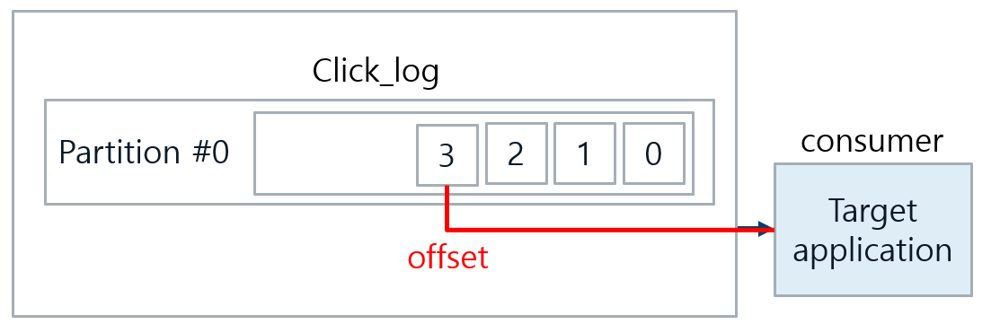
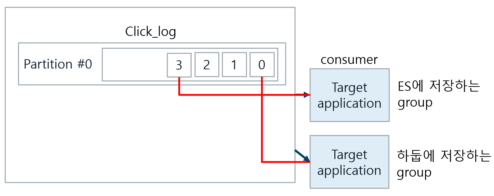

# Kafka
본 자료는 유튜브 데브원영님의 영상 자료를 토대로 공부하여 정리한 내용임.  
## 1. Kafka 개념
### 1.1. Kafka란 
* 데이터를 전송하는 source application과 데이터를 받는 target application이 존재   
* 처음에는 간단한 단방향 통신을 수행한다.  

  
<초기의 간단한 단방향 통신>  

* 이후 시간이 지나며 source, target applicaiton이 많아지면서 데이터를 전송하는 line이 복잡해진다.  

  
<후기의 복잡한 데이터 통신>  

* 데이터 전송 line이 많아지면, 배포와 장애에 대응하기 어려워진다.  
* 데이터 전송시 protocol 포맷의 파편화가 심해진다.  
* 추후 데이터 포맷에 변경사항이 생기면 유지보수가 매우 어려워진다.  

apache kafka는 이러한 복잡함을 해결하기 위한 오픈소스이다.  
* source -> target 의 연결을 약화한다.  
* source -> kafka -> target 의 형식으로 데이터가 전송된다.   
* source application에서 보낼 수 있는 데이터 포맷에는 거의 제한이 없다. ex) json, tsv, avro, ...

  
<kafka의 data flow>  

Kafka는 큐와 비슷하다.  
* 큐에 데이터를 넣는 역할은 producer가, 데이터를 가져가는 역할은 consumer가 하게 된다.  
+) producer, consumer는 library로 구현이 가능하다.  

  
<kafka의 논리적 queue>  

### 1.2. Kafka의 특징
1. fault tolerant(고가용성)  
서버에 이슈가 생기거나 갑작스레 랙이 내려가는 등의 상황에서도 데이터를 손실없이 복구할 수 있다.
2. 낮은 latency(지연) & 높은 throughput(처리량)  
효과적으로 많은 양의 데이터를 처리할 수 있다.

## 2. Kafka topic

### 2.1. topic 외부
topic
* topic을 여러개 가질 수 있다.
* kafka에 들어가는 데이터가 들어갈 수 있는 공간
* 일반적인 AMQP와 다르게 동작한다.

+) AMQP(Advanced Message Queuing Protocol) : 메시지 지향 미들웨어를 위한 개방형 표준 응용 계층 프로토콜.  

  
<kafka topic>  

* producer가 data를 넣고, consumer가 data를 가져간다.
* 목적에 따라 클릭로그, send sms, location log 등과 같이 무슨 데이터를 담는지 명시할 수 있다.
* 이때 명확히 명시하면 추후 유지보수시 편리하다.

### 2.2. topic 내부

* 하나의 토픽은 여러개의 파티션으로 구성된다.  
* 첫번째 파티션은 0부터 시작한다.  
* 하나의 파티션은 큐와 같이 내부에 데이터가 파티션 끝에서부터 쌓이게 된다.   
* 클릭 로그 토픽에 kafka consumer가 붙게 되면 데이터를 가장 오래된 순서로 가져가게 된다.  
* 더이상 데이터가 들어오지 않으면 consumer는 다른 데이터가 들어올 때까지 기다린다.  
* 동일한 데이터를 두번 처리할 수 있다. (중요)
    * consumer가 데이터를 가져가도, 파티션 내부의 데이터는 사라지지않는다.
    * 남아있던 데이터는 다른 consumer가 붙었을 때, 다시 0번부터 가져간다.  
    * 조건 : consumer group이 달라야한다. auto.offset.reset=earliest로 setting 돼있어야 한다.  
* 분석 및 시각화하기 위해 ES에 저장하거나, click log를 백업하기 위해 hadoop에 저장할 수 도 있다.

  
<kafka topic 내부구조>  

#### 파티션이 두개 이상인 경우  
* producer가 data를 보낼 때 키를 지정할 수 있다. 
* 키가 null(key를 사용하지 않음)이며, 기본 파티셔너를 사용하는 경우 round-robin으로 파티션이 지정된다.
* 키가 있고 기본 파티셔너를 사용할 경우, 키의 해시값을 구하고 특정 파티션에 할당된다.
* 파티션을 늘리는 것은 가능하지만, 줄이는 것은 불가능하다.
* 파티션을 늘리면 consumer의 개수를 늘려서 data 처리를 분산시킬 수 있다.
* 파티션의 record(data)는 언제 삭제되는가?
    * 옵션에 따라 다르다. 레코드가 저장되는 최대 시간과 크기를 지정하고, 이에 따라 적절히 삭제된다.
    * 일정한 기간, 용량동안 데이터를 저장, 삭제하도록 설정할 수 있다.
    * log.retention.ms : 최대 record 보존 시간
    * log.retention.byte : 최대 record 보존 크기(byte)

### 2.3. Producer
데이터를 kafka에 보낸다.  
대량의 클릭로그들을 실시간으로 kafka에 적재할 수 있다.  
#### 2.3.1. producer 역할
1. topic에 해당하는 메시지를 생성
2. 특정 topic으로 데이터를 publish
3. 전송 성공여부를 알 수 있어, 처리 실패시 재시도

  
<producer>  

#### 2.3.2. 코딩 (간단히만)
* 아파치 kafka 라이브러리를 추가한다.
* 코딩시 버전에 유의해야한다. 
* 브로커 버전과 클라이언트 버전의 호환성을 숙지하고 알맞는 버전을 사용해야한다.
* key : 메시지를 보내면, 토픽의 파티션이 지정될 때 쓰인다.
* key는 해시알고리즘에 의해 partition과 1:1 매칭되고, 이에 따라 value가 저장된다.
* topic에 파티션을 추가하는 순간, key와 partition의 일관성이 보장되지 않는다. 

### 2.4. Consumer
* 데이터를 kafka로 부터 가져온다.  
* 데이터를 가져오더라도, partition에서 이미 읽힌 record는 사라지지 않는다.  
* 데이터 파이프라인의 특성을 갖는다.  

  
<consumer>  

polling  
* partition에 저장된 데이터를 가져오는 것.  
#### 2.4.1. consumer 역할
1. topic의 partition으로부터 데이터 polling
2. partition offset 위치 기록(commit)
3. consumer group을 통해 병렬처리

offset
* topic과 partition 별로 지정된다.
* consumer가 데이터를 어느 지점까지 읽었는지 나타낸다.
* consumer가 데이터를 읽기 시작하면 offset을 commit하게 되는데 이 정보는 kafka의 \_\_consumer_offset에 저장된다.
* consumer의 offset이 kafka에 저장되어있으므로, consumer에 이슈가 발생하더라도 복구가 가능하다.

  
<consumer의 offset>  

#### 2.4.2. multiple consumer

ex) partition이 두개인 경우  
if) cunsumer가 1개라면  
then) 하나의 consumer가 2개의 partition에서 데이터를 가져온다.  
if) consumer가 2개라면  
then) 2개의 cunsumer가 각각 partition 하나씩 맡아 데이터를 가져온다.  
if) consumer가 3개라면  
then) 이미 consumer가 하나씩 partition을 할당받았으므로, 하나의 consumer는 동작하지 않는다.  

so, consumer를 병렬처리하려면 "partition 개수 >= consumer 개수" 여야 한다.  

#### 2.4.3. Different groups
consumer gruop과 topic 별로 kafka에 consumer offset을 나누어 저장하기 때문에 consumer group 별로 처리할 수 있는 것.

  
<multiple consumer group>  

# 3. Kafka의 핵심요소
kafka의 고가용성을 유지하는데에 중요한 역할을 한다.  
## 3.1. Broker
kafka가 설치돼있는 서버 단위
보통 3개이상의 broker를 사용하는 것을 권장한다.

ex) partition = 1개, replication = 1인 topic이 존재, broker가 3대라면  
broker 3대 중 1대에 해당 토픽의 데이터가 저장된다.  

## 3.2. replication(복제)
kafka 아키텍쳐의 핵심  
클러스터에서 서버에 장애가 생길 때, 가용성을 보장할 수 있다.  
파티션의 복제를 의미한다.  

* replication의 개수가 1이라면 partition은 1개만 존재한다는 것.  
* replication의 개수가 2라면 partition은 원본 1개와 복제본 1개로 총 2개가 존재한다.  
* replication의 개수가 3이라면 partition은 원본 1개와 복제본 2개로 총 3개가 존재한다.  

broker 개수에 따라 replication 개수가 제한된다.  
원본 1개의 partition은 leader partition, 나머지 복제본 partition은 folower partition이라고 부른다.  

replication의 개수가 많아지면 그만큼 broker의 resource 사용량도 늘어난다.  

  
<partition 1개, replication 3개인 경우>

## 3.3. ISR(In Sync Replica)

leader partition + follower partition = ISR

replication을 사용하는 이유?
replication은 partition의 고가용성을 위해 사용된다.
broker가 어떠한 이유로 사용이 불가능해질 경우, 복제본이 있다면 복구가 가능하다.
leader partition이 죽으면, follower partition이 leader partition 역할을 승계하게 된다.
## 3.4. ack
0, 1, all 세가지 옵션 중 한 개를 골라 사용한다.  

#### 0일 경우
producer는 leader partition에 데이터를 전송하고 응답값을 받지 않는다.  
so, leader에 데이터가 정상적으로 전송됐는지, 복제는 제대로 됐는지 알 수 없다.  
속도는 빠르지만 데이터 유실가능성이 있다.  

#### 1일 경우
producer는 leader partition에 데이터를 전송하고 leader partition에 대해 응답값을 받는다.  
but, 나머지 partition에 복제됐는지 알 수 없다.  
leader partition이 데이터를 받은 즉시 broker에 장애가 생기면, 나머지 partition에 데이터가 전송되지 못한 상태이므로 ack 0일 경우와 같은 데이터 유실 가능성이 있다.  

#### all일 경우
producer는 leader partition에 데이터를 전송하고 leader partition과 follower partition에대해 응답값을 받는다.  
데이터 유실 가능성이 없으나, 속도가 현저히 느리다.  

# 4. Lag
## 4.1. lag
* producer가 데이터를 넣어주는 속도가 consumer가 가져가는 속도보다 빠른 경우 발생
* producer가 마지막으로 넣은 offset과 consumer가 마지막으로 읽은 offset간에 gap이 생기게 된다.
* 그 gap을 consumer lag라고 한다.

  
<multiple consumer group>  

consumer가 비정상적으로 동작하면 lag이 필연적으로 발생한다.

* partition의 개수가 여러개이면 lag도 여러개 존재할 수 있다. 
* 그 중 가장 높은 숫자의 lag을 records-lag-max라 부른다.

  
<multiple consumer group> 
   
## 4.2. Burrow
* Kafka-client 라이브러리를 통해 kafkaconsumer 객체를 만들 수 있고, 이를 통해 lag을 얻을 수 있다.
* But, consumer 단위로 lag을 모니터링하는 것은 위험하며, 운영요소가 많이 소비된다.
* So, Burrow 사용하자.

### Burrow 특징
* 오픈소스로서, golang으로 작성되었다.

1. 멀티 kafka 클러스터를 지원한다.
   * kafka 클러스터가 여러개더라도, burrow application 1개만 실행해서 연동하면 kafka 클러스터들에 붙은 consumer의 lag을 모두 모니터링할 수 있다.
2. sliding window를 통한 consumer의 status 확인
   * sliding window를 통해 consumer의 status를 'ERROR', 'WARNING', 'OK'로 표현한다.
   * 데이터 양이 일시적으로 많아지며, consumer offset이 증가되고 있으면 WARNING
   * 데이터 양이 많아지는데 consumer가 데이터를 가져가지 않으면 ERROR
3. HTTP api 제공

