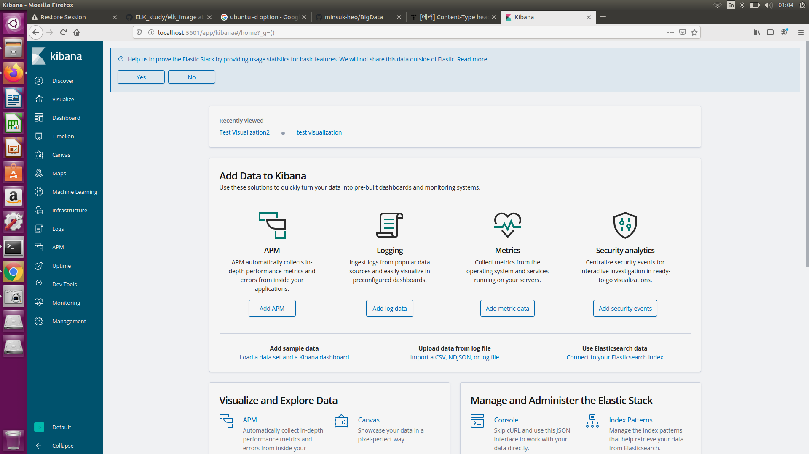

# Kibana

# 1. Kibana 실습

## 1.1. Kibana 실행
키바나를 실행하기 전 ES를 실행해주어야한다.

    $ <elasticsearch 패키지 파일>/bin/elasticsearch -d
    $ sudo systemctl start elasticsearch.service
    $ sudo systemctl start kibana.service

* elasticsearch가 설치된 디렉토리안의 elasticsearch를 -d 옵션을 통해 daemon으로 실행시킨다.  
* elasticsearch.service를 실행시킨다.
* kibana도 실행시킨다.  
  
<Kibana 실행 화면>  

## 1.2. Management

왼쪽의 management를 클릭하여 들어가 index name or pattern을 원하는 index명으로 지정해 넣어준다.  
mapping한 것을 kibana가 인식하는 것을 확인할 수 있다.  

## 1.3. Discover
### 1.3.1. time filter

discover 메뉴에서 'No results found' 라고 뜨게 된다면, data가 지난 15분간 없었기 때문이다.  
따라서 오른쪽 상단의 time filter를 변경시켜준다.  

Quick 필터  
직접 quick 필터하는 쉬운 방법
?? 뭔소랴

Relative 필드  
상대적으로 시간을 조절할 수 있는 기능  

Absolute 필드  
절대적으로 시간을 조절할 수 있는 기능  

### 1.3.2. table information

* 원하는 정보만 보고 싶으면 table에서 돋보기 형태를 클릭하여 그래프에 원하는 정보만 띄울 수 있다. 

* table에서 원하는 정보만 보고 싶다면, toggle 버튼을 클릭하여 table에 원하는 정보만 띄울 수 있다.  

## 1.4. Visualize
왼쪽 메뉴에서 visualize tab을 선택한다.  
+) 다음의 수행 순서는 정해진 순서가 아닌, 공부하며 참고가 될 수 있게 작성하였으므로, 정형화하여 간단히 표현한 것이다.  
### 1.4.1. Bar chart
 
vertical bar chart를 선택한다.  

1. Select Index에서 원하는 index를 선택한다.
2. metrics에서 y축에 원하는 aggregation 및 field를 선택한다.  
3. 이때 custom label은 visualization에 표시되는 label명을 지정하는 것이다.
4. select buckets type에 있는 x축을 선택한다.
5. aggregation과 field를 알맞게 선택한다.

ex) aggregation에서 평균값을 구하고자 하면 Average를 선택한다.  

### 1.4.2. Pie chart
Pie chart를 선택한다.  

1. Select Index에서 원하는 index를 선택한다.
2. metrics에서 원하는 aggregation 및 field를 선택한다.
3. buckets로 aggregation과 field를 선택하여 원하는 데이터를 선택한다.

### 1.4.3. Tile map
Tile map을 선택한다.

1. geo coordinate를 선택한다.
2. 원하는 정보에 따른 field를 선택한다.
3. 플레이 버튼을 선택하여 변경사항을 적용시킨다. 

## 1.5. Dashboard
1. visualize tab에서 원하는 chart를 save한다.  
2. dashboard tab에서 save한 chart를 선택하여 dashboard에 나타낸다.  
3. 직접 드래그하여 각각의 chart 크기, 위치를 수정하여 꾸민다. 
